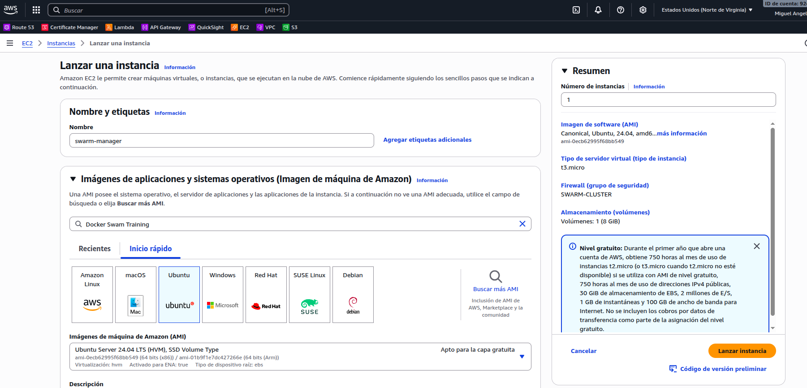
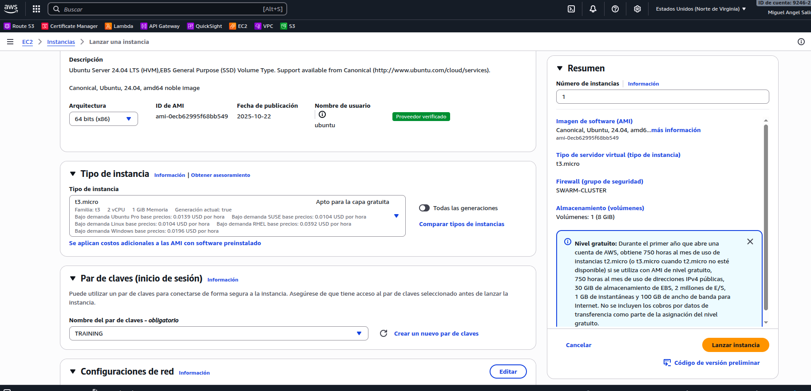
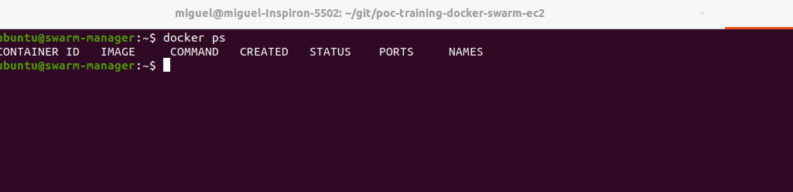
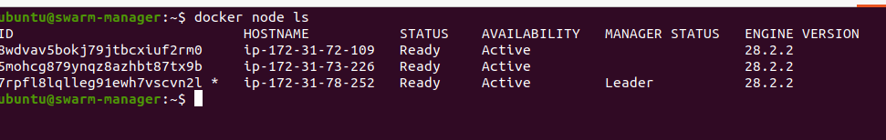
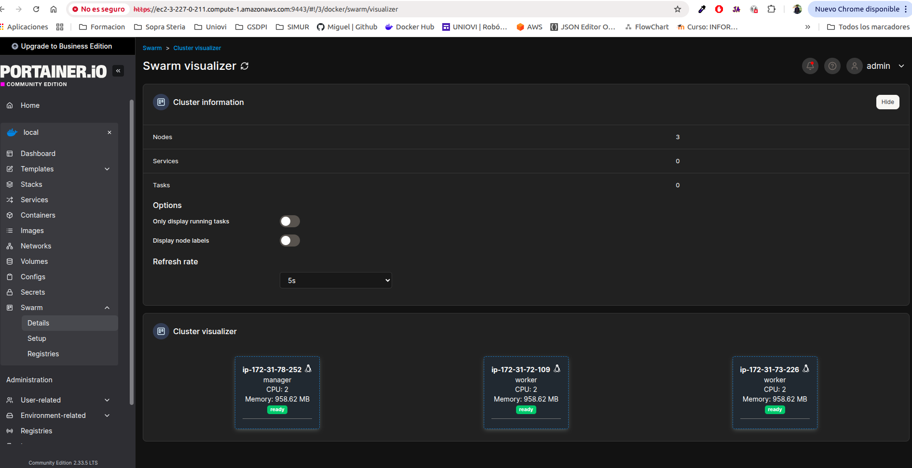

# Description
A simple Docker Swarm cluster made of: one manager and two workers using docker containers deployed in AWS EC2

## Desploy
Follow the next steps to deploy your docker swarm cluster in EC".

- **STEP1**: Create a particular security group for the swarm cluster with these ports from AWS


- **STEP1**: Create the infrastructure from AWS
The infraestructure will be three micro VM 1GB memory from EC2. When create your VMs select the your key-pair to logion from your host

- swarm-manager: manager swarm node
- swarm-worker-01: worker 01 swarm node
- swarm-worker-02: worker 02 swarm node






- **STEP3**: login inside AWS and create the infrastructure
```
$ ssh -i TRAINING.pem ubuntu@ec2-3-227-0-211.compute-1.amazonaws.com
$ ssh -i TRAINING.pem ubuntu@ec2-3-233-233-241.compute-1.amazonaws.com
$ ssh -i TRAINING.pem ubuntu@ec2-44-221-59-139.compute-1.amazonaws.com
```

- **STEP4**: Edit the prompt to set the swarm node name

Edit the file 
```
$ nano ~/.bashrc
```

And set the PS1 environment variable like this for swarm manager:

```
if [ "$color_prompt" = yes ]; then
    # PS1='${debian_chroot:+($debian_chroot)}\[\033[01;32m\]\u@\h\[\033[00m\]:\[\033[01;34m\]\w\[\033[00m\]\$ '
    PS1='${debian_chroot:+($debian_chroot)}\[\033[01;32m\]\u@swarm-manager\[\033[00m\]:\w\[\033[00m\]\$ '
else
    # PS1='${debian_chroot:+($debian_chroot)}\u@\h:\w\$ '
    PS1='${debian_chroot:+($debian_chroot)}\u@swarm-manager:\w\$ '
fi
```



- **STEP4**: Install docker in each VM
```
$ sudo apt update
$ sudo apt install -y docker.io
$ sudo usermod -aG docker $USER
```

You must exist and ssh again to use docker CLI without sudo

- **STEP4**: configure the manager VM 

For swarm manager execute:

```
$ docker swarm init --advertise-addr <SWARM_NODE_PRIVATE_IP>
Swarm initialized: current node (7rpfl8lqlleg91ewh7vscvn2l) is now a manager.

To add a worker to this swarm, run the following command:

    docker swarm join --token <TOKEN_WORKER_NODE> <SWARM_NODE_PRIVATE_IP>:2377

To add a manager to this swarm, run 'docker swarm join-token manager' and follow the instructions.
```

Where <MANAGER_PRIVATE_IP> is the EC2 private IP

For swarm worker:

```
$ docker swarm join --token <TOKEN_WORKER_NODE> <SWARM_NODE_PRIVATE_IP>:2377
This node joined a swarm as a worker.

$ docker swarm join --token <TOKEN_WORKER_NODE> <SWARM_NODE_PRIVATE_IP>:2377
This node joined a swarm as a worker.
```



- **STEP5**: install portainer

Inside swarm manager execute:

```
$ docker volume create portainer_data
$ docker run -d -p 9000:9000 -p 9443:9443 --name portainer --restart=always -v /var/run/docker.sock:/var/run/docker.sock -v portainer_data:/data portainer/portainer-ce:latest
```

Configure the first time the admin user as usual


